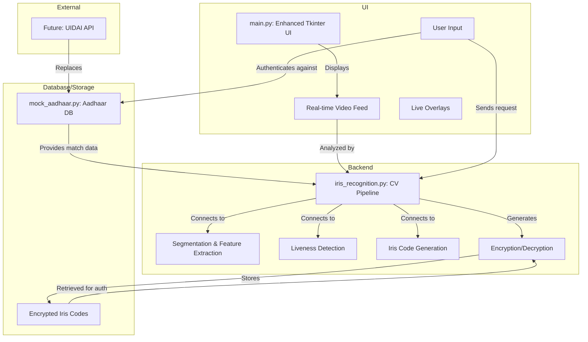

# EyeQ: Redefining Security with Biometric Iris Authentication

## The EyeQ Mission
EyeQ is a cutting-edge, iris-based authentication tool developed for the SEBI Secure Markets Hackathon. Our mission is to create a new benchmark for security in the financial sector, providing a robust, multi-layered defense against fraud through advanced biometric verification. By moving beyond conventional authentication methods, EyeQ offers a secure, user-centric, and transparent solution that aligns perfectly with SEBI's Safe Space Initiative.

## Why EyeQ? Our Value Proposition
In the high-stakes world of financial markets, security cannot be a compromise. EyeQ addresses critical vulnerabilities with a solution that is not only robust but also scalable and user-friendly.

- **Unwavering Security**: By leveraging multi-eye data, advanced liveness detection, and military-grade encryption, EyeQ provides a defense against spoofing and identity fraud that is virtually impenetrable.
- **Seamless User Experience**: Real-time visual guidance and an intuitive interface make biometric authentication simple, even for users who are new to the technology.
- **Scalability for the Future**: Our modular architecture is designed for easy integration with existing systems and future enhancements, ensuring EyeQ remains a powerful tool for years to come.

## The Core Innovation
The power of EyeQ lies in its innovative features, which provide a level of accuracy and resilience far beyond standard biometric tools.

- **Multi-Eye Data & Averaging**: Unlike systems that rely on a single data point, EyeQ captures and processes data from both eyes. By averaging the unique biometric features of each iris, the system significantly boosts authentication accuracy and reduces the chance of false negatives.
- **Advanced Liveness Detection**: EyeQ's liveness check is sophisticated, using a combination of blink detection and subtle eye movement tracking. This intelligent system makes it virtually impossible to spoof the verification process with static images, videos, or other non-live representations.
- **Gabor Multi-Orientation Feature Extraction**: To ensure every unique detail of the iris is captured, EyeQ employs Gabor filters across multiple orientations. This technique extracts a richer, more robust feature set from the iris, resulting in a highly precise and reliable biometric code.
- **Fernet-Secured Data**: Security is paramount. All generated iris codes and sensitive biometric data are immediately encrypted using the industry-standard Fernet symmetric encryption algorithm, guaranteeing data integrity and protecting user privacy from the moment of capture.
- **Intelligent User Guidance**: The system guides the user in real-time with on-screen visual overlays, including eye and iris bounding boxes. This makes distant, accurate capture a seamless process, providing real-time feedback on lighting and position to ensure optimal conditions.

## Redefined UI/UX
The EyeQ user interface is crafted for a modern, intuitive, and efficient experience.

- **Themed Aesthetics**: Built with a professional `ttkthemes` and the clean `arc` theme, the UI offers a polished and trustworthy look.
- **Dynamic Feedback**: A real-time progress bar and a clear feedback system provide constant updates on the authentication status, keeping the user informed at every step.
- **Responsive Video Feed**: The live video feed is larger and more responsive, with intelligent overlays that adapt to screen size for a consistent experience across devices.

## Architectural Blueprint
The EyeQ system is built on a modular architecture, with a clear separation of concerns to ensure scalability and maintainability. The diagram below illustrates the core components and their interactions.



## Authentication Workflow
The following flowchart outlines the step-by-step authentication process, from the user's perspective to the system's internal checks.

```mermaid
graph TD
    A[Launch Application] --> B{Enter Aadhaar (Demo)};
    B --> C{Click 'Capture' Button};
    C --> D[Begin Liveness & Capture Check];
    D --> E{Liveness Check Passed?};
    E -- No --> F[Display: 'Blink to confirm.'];
    E -- Yes --> G[Capture Iris Image];
    G --> H[Segment Iris];
    H --> I[Extract Features];
    I --> J[Generate Iris Code];
    J --> K[Retrieve Aadhaar-linked Iris Code from DB];
    K --> L{Compare Codes};
    L -- No Match --> M[Display: 'Authentication Failed.'];
    L -- Match --> N[Display: 'Authentication Successful!'];
    N --> P[End Process];
    M --> P;
    F --> D;
```

## Quick Start Guide
Getting started with EyeQ is simple. Just follow these steps to get the application up and running on your local machine.

1. Clone the repository:
   ```bash
   git clone <repo-url>
   ```
2. Navigate to the project directory:
   ```bash
   cd EyeQ
   ```
3. Install dependencies:
   ```bash
   pip install -r requirements.txt
   ```
4. Run the application:
   ```bash
   python main.py
   ```

**Note**: The mock Aadhaar database is for hackathon demonstration. A real-world implementation would integrate with the UIDAI API for secure, federated identity verification.

## Tech Stack & Hardware
- **Python**: 3.12+
- **Computer Vision & Data Processing**: OpenCV, NumPy, PyTorch
- **UI**: Tkinter, ttkthemes, Pillow
- **Web & APIs**: Requests
- **Security**: Cryptography (Fernet)
- **Hardware**: A high-resolution webcam is required for optimal performance.

## Future Vision
Our work on EyeQ is ongoing. We have a clear roadmap for continued innovation, including:

- **AI-Powered Distance Optimization**: Integrating an AI model for intelligent zoom and auto-focus will allow the system to handle an even wider range of user distances, making it accessible for everyone.
- **Deep Learning for Segmentation**: The existing segmentation can be replaced with a sophisticated U-Net model trained in PyTorch, which would drastically improve accuracy in challenging or low-light conditions.
- **Mobile Portability**: The application could be ported to mobile platforms using frameworks like Kivy or Flutter, making it a truly on-the-go biometric solution.

## License
This project is licensed under the MIT License, which is ideal for hackathon projects. Credit is appreciated if the code is used in a derivative work.
